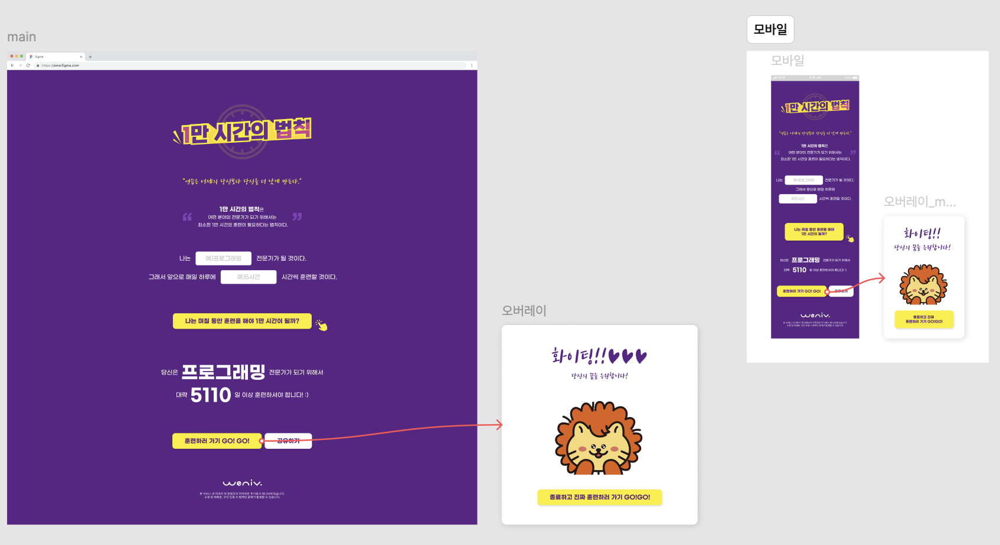
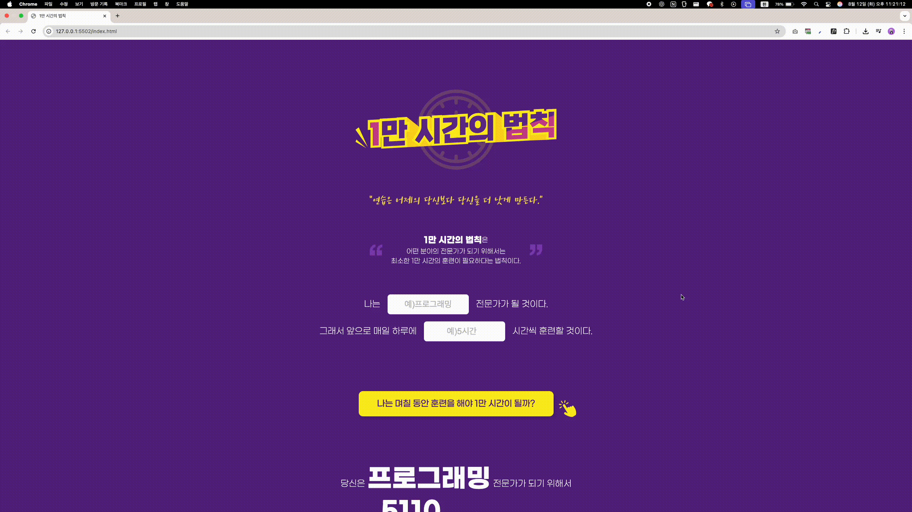
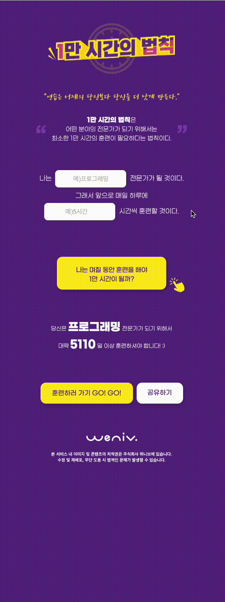

# 1만 시간의 법칙

1만 시간의 법칙을 테마로 한 반응형 웹 애플리케이션입니다. 웹 접근성을 고려한 시맨틱 HTML과 CSS를 활용하여 구현했습니다.

## 목차

- [프로젝트 소개](#프로젝트-소개)
- [주요 기능](#주요-기능)
- [기술 스택](#기술-스택)
- [프로젝트 구조](#프로젝트-구조)
- [개발 일정](#개발-일정)
- [화면 설계도](#화면-설계도)
- [실행 방법](#실행-방법)
- [주요 구현 사항](#주요-구현-사항)
- [웹 접근성 고려사항](#웹-접근성-고려사항)
- [반응형 디자인](#반응형-디자인)
- [에러와 에러 해결](#에러와-에러-해결)
- [개발하며 느낀점](#개발하며-느낀점)
- [참고자료](#참고자료)

## 프로젝트 소개

1만 시간의 법칙은 어떤 분야의 전문가가 되기 위해서는 최소한 1만 시간의 훈련이 필요하다는 법칙을 바탕으로, 사용자가 원하는 분야와 하루 훈련 시간을 입력하면 1만 시간 달성까지 필요한 일수를 계산해주는 웹 애플리케이션입니다.

### 프로젝트 목표

- 사용자가 쉽게 1만 시간의 법칙을 체험할 수 있는 인터페이스 제공
- 반응형 디자인으로 다양한 디바이스에서 접근 가능
- 접근성을 고려한 웹 표준 준수

## 주요 기능

- **반응형 디자인**: 데스크톱, 태블릿, 모바일 환경 지원
- **모달 시스템**: 응원 메시지 및 라이캣 캐릭터 모달
- **웹 접근성**: 스크린 리더 지원 및 키보드 네비게이션
- **1만 시간 계산기**: 분야와 시간 입력을 통한 일수 계산 (추후 구현 예정)

## 기술 스택

- **HTML**: 시맨틱 마크업
- **CSS**:
  - CSS Grid & Flexbox
  - CSS Custom Properties (변수)
  - Media Queries
  - clamp() 함수
- **JavaScript**:
  - DOM 조작
  - 이벤트 리스너
  - 모달 기능
- **명명법**: 카멜 케이스 (camelCase) - 단어 사이를 대문자로 연결하여 가독성을 높이고 일관성 있는 클래스명 사용

## 📁 프로젝트 구조

```
2025-project-10000hours-rule/
├── index.html              # 메인 HTML 파일
├── styles/
│   ├── reset.css           # CSS 리셋
│   ├── style.css           # 메인 스타일
│   └── mobile.css          # 모바일 스타일
├── js/
│   └── modal.js            # 모달 기능 JavaScript
├── images/
│   ├── title.png           # 타이틀 이미지
│   ├── quote.png           # 인용구 이미지
│   ├── left.png            # 왼쪽 따옴표
│   ├── right.png           # 오른쪽 따옴표
│   ├── icon.png            # 커서 아이콘
│   ├── logo-m.png          # 로고
│   ├── licat-img.png       # 라이캣 캐릭터
│   ├── modal-text.png      # 모달 텍스트
│   └── modal-text-2x.png   # 모달 텍스트 (2x)
├── fonts/                  # 폰트 파일들
└── README.md              # 프로젝트 문서
```

## 📅 개발 일정

### 1단계: 데스크톱 버전 작업 (1일차)

- [x] 작업 폴더 구조 생성 (HTML, CSS 등)
- [x] 피그마 파일 검토 및 디자인 요소 다운로드
- [x] 필요한 이미지, 아이콘, 폰트 등의 자산 추출/준비
- [x] 기본 HTML 파일 생성
- [x] 기본 CSS 파일 생성 (Reset CSS 포함)
- [x] 페이지 구조 분석 및 적절한 시멘틱 태그 선정 (header, nav, main, section, article, footer 등)
- [x] 접근성을 고려한 태그 사용 계획
- [x] 브레이크포인트 설정 (모바일, 데스크톱)
- [x] 모바일 퍼스트 vs 데스크톱 퍼스트 접근 방식 결정
- [x] 이미지 요소의 반응형 처리 방법 계획
- [x] HTML 기본 구조 마크업 작성
- [x] 기본 스타일 및 레이아웃 CSS 작성
- [x] 데스크톱 버전 스타일링

### 2단계: 모바일 버전 작업 (2일차)

- [x] 모달창 구현 및 마무리
- [x] 브레이크포인트 설정 (모바일, 데스크톱)
- [x] 모바일 버전 스타일링 (미디어 쿼리 적용)
- [x] 이미지 요소의 반응형 처리
- [x] 적절한 대체 텍스트(alt) 제공
- [x] 키보드 접근성 확인

## 와이어프레임 / UI

### 데스크톱 | 모바일 버전



## 구현 화면 및 기능

### 데스크톱 버전



### 모바일 버전



## 실행 방법

1. 프로젝트 클론

```bash
git clone https://github.com/your-username/2025-project-10000hours-rule.git
cd 2025-project-10000hours-rule
```

## 🌐 배포 링크

**Live Demo**: [https://chaehyeon119.github.io/2025-project-10000hours-rule/](https://chaehyeon119.github.io/2025-project-10000hours-rule/)

## 주요 구현 사항

### 1. CSS Custom Properties 활용

```css
:root {
  --bg-purple: #5b2386;
  --text-white: #fff;
  --yellow: #fcee21;
  --btn-yellow: #fcee21;
  --font-main: "GmarketSans", sans-serif;
  --placeholder-gray: #babcbe;
}
```

### 2. 반응형 폰트 크기 (clamp 함수)

```css
/* 폰트가 넘치는 문제를 해결해줌 */
font-size: clamp(1.4rem, 2.5vw, 1.8rem);
```

### 3. 모달 시스템

**HTML 구조:**

```html
<dialog id="myDialog" class="modal-dialog" aria-labelledby="modal-title">
  <div class="modal-container">
    <h4 id="modal-title" class="a11y-hidden">응원 메시지</h4>
    <div
      class="cheering-text"
      aria-label="화이팅! 당신의 꿈을 응원합니다!"
    ></div>
    
    <button id="closeBtn" class="modal-btn" type="button">
      종료하고 진짜 훈련하러 가기 GO!GO!
    </button>
  </div>
</dialog>
```

**JavaScript (js/modal.js):**

```javascript
const dialog = document.getElementById("myDialog");
const showDialogBtn = document.getElementById("showDialogBtn");
const closeBtn = document.getElementById("closeBtn");

showDialogBtn.addEventListener("click", () => dialog.showModal());
closeBtn.addEventListener("click", () => dialog.close());
```

### 4. 시맨틱 HTML 구조

```html
<header class="title-section">
  <h1 class="a11y-hidden">1만 시간의 법칙</h1>
  <!-- 타이틀 이미지 -->
</header>

<main class="container">
  <section class="description">
    <h2 class="a11y-hidden">1만 시간의 법칙 설명</h2>
    <!-- 설명 내용 -->
  </section>

  <section class="form-section">
    <h2 class="a11y-hidden">1만 시간 계산기</h2>
    <!-- 폼 요소들 -->
  </section>
</main>
```

## 웹 접근성 고려사항

### 1. 시맨틱 HTML 구조

- `<header>`, `<main>`, `<footer>` 태그 활용
- `<nav>`, `<section>`, `<article>` 등 의미있는 태그 사용
- `aria-labelledby`, `aria-describedby` 속성으로 연결

### 2. HTML Role 속성 활용

**WAI-ARIA Role 속성을 통한 웹 접근성 향상:**

```html
<!-- 모달 다이얼로그에 role 속성 적용 -->
<dialog id="myDialog" class="modal-dialog" aria-labelledby="modal-title">
  <div class="modal-container">
    <h4 id="modal-title" class="a11y-hidden">응원 메시지</h4>
    <div
      class="cheering-text"
      aria-label="화이팅! 당신의 꿈을 응원합니다!"
    ></div>
    
    <button id="closeBtn" class="modal-btn" type="button">
      종료하고 진짜 훈련하러 가기 GO!GO!
    </button>
  </div>
</dialog>
```

**적용된 Role 속성들:**

- **`aria-labelledby`**: 모달 제목과 연결하여 스크린 리더가 모달의 목적을 인식
- **`aria-label`**: 배경 이미지 텍스트에 대한 설명 제공
- **`aria-hidden`**: 시각적으로만 보이는 장식 요소를 스크린 리더에서 제외
- **`dialog`**: HTML5 네이티브 다이얼로그 요소로 모달의 역할 명시

### 3. 스크린 리더 지원

```html
<!-- 스크린 리더 전용 설명 -->
<h1 class="a11y-hidden">1만 시간의 법칙</h1>

<!-- 접근성 숨김 클래스 -->
.a11y-hidden { position: absolute; width: 1px; height: 1px; padding: 0; margin:
-1px; overflow: hidden; clip: rect(0, 0, 0, 0); white-space: nowrap; border: 0;
}
```

### 4. 이미지 대체 텍스트

```html

```

## 반응형 디자인

### 1. 데스크톱 우선 접근법

- 기본 스타일은 데스크톱 기준
- `@media screen and (max-width: 576px)` 로 모바일 스타일 적용

### 2. 유연한 레이아웃

```css
/* max-width와 width:100% 속성의 중요성 */
.container {
  max-width: 192rem;
  width: 100%;
  margin: 0 auto;
}
```

### 3. 반응형 간격

```css
/* clamp를 활용한 반응형 간격 */
gap: clamp(12px, 3vw, 40px);
padding: clamp(12px, 2.2vw, 32px) clamp(16px, 4vw, 32px);
```

## 에러와 에러 해결

### 1. CSS 관련 에러

#### 문제: 반응형 이미지 크기 조정

**에러 상황**: 이미지가 화면 크기에 따라 적절히 조정되지 않음

**해결 방법**: `clamp()` 함수와 `aspect-ratio` 속성 활용

### 2. 웹 접근성 관련 에러

#### 문제: 스크린 리더가 이미지 내용을 읽지 못함

**에러 상황**: 장식용 이미지에 불필요한 alt 텍스트 제공

**해결 방법**: 장식용 이미지는 `alt=""` 또는 `aria-hidden="true"` 사용

```html
<!-- 기존 코드 -->


<!-- 해결된 코드 -->

```

### 3. 반응형 디자인 관련 에러

#### 문제: 모바일에서 레이아웃이 깨지는 현상

**에러 상황**: 고정된 픽셀 값 사용으로 인한 반응형 문제

**해결 방법**: 상대 단위와 clamp() 함수 활용

```css
/* 기존 코드 */
gap: 30px;
padding: 32px;

/* 해결된 코드 */
gap: clamp(12px, 3vw, 40px);
padding: clamp(12px, 2.2vw, 32px) clamp(16px, 4vw, 32px);
```

### 4. 이미지 품질 관련 에러

#### 문제: 고해상도 디스플레이에서 이미지가 깨지는 현상

**에러 상황**: 레티나 디스플레이나 고해상도 모니터에서 텍스트 이미지가 흐릿하게 표시됨

**해결 방법**: 2배 해상도 이미지 적용

```css
/* 기본 이미지 */
.cheering-text {
  background: url("../images/modal-text.png") no-repeat center;
  background-size: cover;
  width: clamp(20rem, 20.625vw, 39.6rem);
  aspect-ratio: 396 / 150;
  margin: 0 auto;
}

/* 고해상도 디스플레이 대응 */
@media (min-width: 800px) {
  .cheering-text {
    background-image: url("../images/modal-text-2x.png");
    background-size: cover;
  }
}
```

**해결 효과:**

- **선명한 텍스트**: 고해상도 디스플레이에서도 깨끗한 텍스트 표시
- **자동 전환**: 화면 크기에 따라 적절한 해상도 이미지 자동 선택
- **사용자 경험 향상**: 모든 디바이스에서 최적의 이미지 품질 제공
- **폰트 파일 로딩 시간 단축**: 사용 빈도가 낮은 폰트 파일 다운로드 불필요
- **네트워크 요청 감소**: 폰트 파일 대신 이미지 하나로 처리하여 HTTP 요청 최소화

## 개발하며 느낀점

### 1. CSS 코드 축소의 중요성

- 단축 속성 사용
- CSS Custom Properties로 일관성 있는 디자인 시스템 구축

### 2. 반응형 디자인의 어려움

- `clamp()` 함수로 폰트 크기 반응형 처리
- `max-width`와 `width: 100%` 조합으로 컨테이너 반응형 구현

### 3. 웹 접근성의 실무적 적용

- 시맨틱 HTML의 중요성 재확인
- 스크린 리더 사용자를 위한 적절한 대체 텍스트 제공
- 키보드 네비게이션 지원의 필요성

### 4. 성능 최적화

- 이미지 최적화 및 적절한 포맷 선택
- CSS와 JavaScript 파일 분리로 유지보수성 향상
- **🚀 성능 최적화**: Lighthouse 모바일: **95점** | 데스크톱: **95점**

### 5. 웹폰트 최적화

**로컬 폰트 사용의 장점:**

```css
@font-face {
  font-family: "GmarketSans";
  src: url("../fonts/GmarketSansLight.woff") format("woff");
  font-weight: 400;
  font-style: normal;
}

@font-face {
  font-family: "Noto Sans KR";
  src: url("../fonts/NotoSansKR-VariableFont_wght.ttf") format("truetype");
  font-display: swap;
}
```

- **외부 의존성 제거**: CDN 폰트 로딩 실패 위험 없음
- **로딩 성능 향상**: 로컬 파일로 빠른 폰트 로딩
- **오프라인 지원**: 인터넷 연결 없이도 폰트 정상 표시
- **폰트 가중치 체계화**: Bold, Regular, Medium, Light 등 체계적 관리

### 6. 텍스트 이미지 활용 전략

**사용 빈도가 낮은 폰트의 효율적 처리:**

특정 텍스트가 한 번만 사용되거나 사용 빈도가 매우 낮은 경우, 폰트 파일을 다운로드하는 것보다 이미지로 처리하는 것이 더 효율적입니다.

```css
/* 모달 응원 메시지를 이미지로 처리 */
.cheering-text {
  background: url("../images/modal-text.png") no-repeat center;
  background-size: cover;
  width: clamp(20rem, 20.625vw, 39.6rem);
  aspect-ratio: 396 / 150;
  margin: 0 auto;
}

/* 고해상도 디스플레이 대응 */
@media (min-width: 800px) {
  .cheering-text {
    background-image: url("../images/modal-text-2x.png");
    background-size: cover;
  }
}
```

**텍스트 이미지 사용의 장점:**

- **폰트 파일 로딩 시간 단축**: 사용 빈도가 낮은 폰트 파일 다운로드 불필요
- **네트워크 요청 감소**: 폰트 파일 대신 이미지 하나로 처리하여 HTTP 요청 최소화
- **초기 렌더링 속도 향상**: 폰트 로딩 대기 시간 없이 즉시 텍스트 표시
- **디자인 정확성**: 디자이너가 의도한 정확한 폰트 스타일 보장

### 7. 코드리뷰의 중요성

- 코드리뷰를 통해 잠재적인 버그와 개선점을 발견할 수 있었음
- 다른 개발자의 관점에서 코드를 바라보는 것의 가치를 깨달음
- 코드 품질과 가독성 향상에 큰 도움이 됨

## 🔮 추후 구현 사항

### 1. 1만 시간 계산기 기능

현재는 정적인 결과만 표시되지만, 추후 다음과 같은 기능을 구현할 예정

#### 입력 검증

- 분야 입력 필드: 빈 값 체크, 특수문자 제한
- 시간 입력 필드: 숫자만 입력 가능, 1-24시간 범위 제한

#### 계산 로직

#### 동적 결과 표시

- 입력값에 따른 실시간 결과 업데이트
- 애니메이션 효과와 함께 결과 표시
- 결과 저장 및 히스토리 기능

## 참고자료

- [MDN Web Docs - WAI-ARIA Roles](https://developer.mozilla.org/en-US/docs/Web/Accessibility/ARIA/Reference/Roles)
- [인프런] 아는 만큼 보이는 웹 접근성 WCAG

## 🔗 링크

- **GitHub Repository**: [https://github.com/chaehyeon119/2025-project-10000hours-rule](https://github.com/chaehyeon119/2025-project-10000hours-rule)
- **Live Demo**: [https://chaehyeon119.github.io/2025-project-10000hours-rule/](https://chaehyeon119.github.io/2025-project-10000hours-rule/)

---

**참고**: 본 프로젝트는 [모두의연구소/위니브] 프론트엔드 스쿨 HTML/CSS 프로젝트 목적으로 제작되었습니다.

**개발자**: 김채현  
**기술 스택**: HTML, CSS, JavaScript
